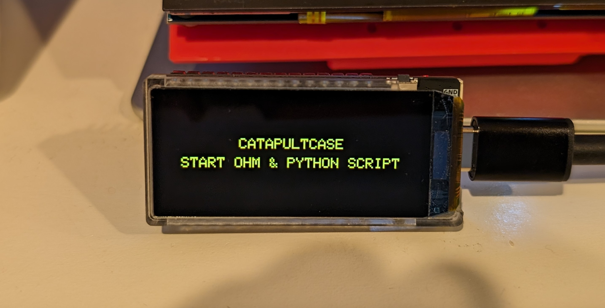
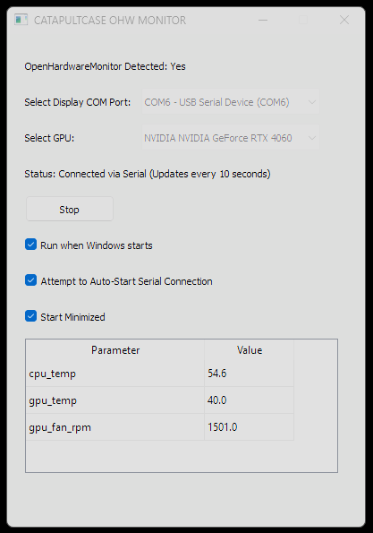
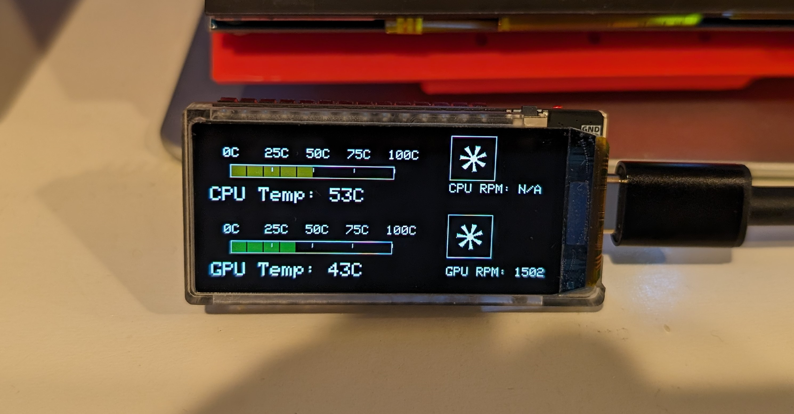

# CATAPULTCASE OpenHardwareMonitor Display App
CC_HW_GUI_v0.10

Requirements:
- Lilygo T-Display S3 AMOLED (https://www.lilygo.cc/products/t-display-s3-amoled)
- Windows 11
- Openhardwaremonitor-v0.9.6

Current issues:
- The CPU fan speed is not read in this initial release
- GPU selection does not influence the queried GPU metrics

Setup:
1. Compile the contents of GUI_Python_Code folder by running PyInstaller in the directory with all files present, using the CC_HW_GUI.spec configuration file
3. Compile the contents of Arduino_Code folder and flash to the Lilygo display 
4. Reconnect/reset the Lilygo display and you should see the splash screen
   

5. Obtain and run OpenHardwareMonitor - this software was tested using v0.9.6
6. Run the compiled CC_HW_GUI.exe and configure using the GUI

Press the 'START" button and the metrics should start to feed the LilyGo display

